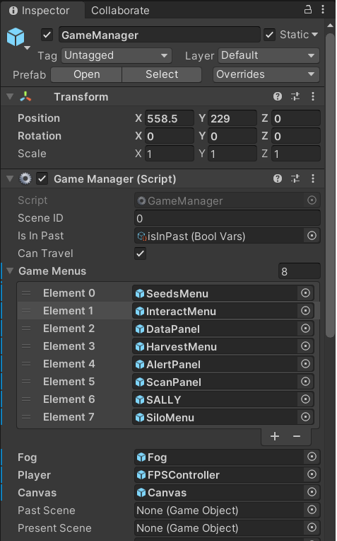
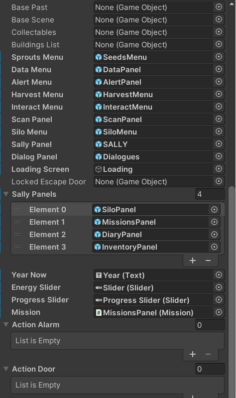
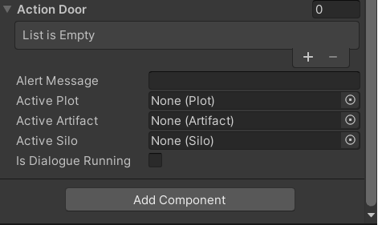
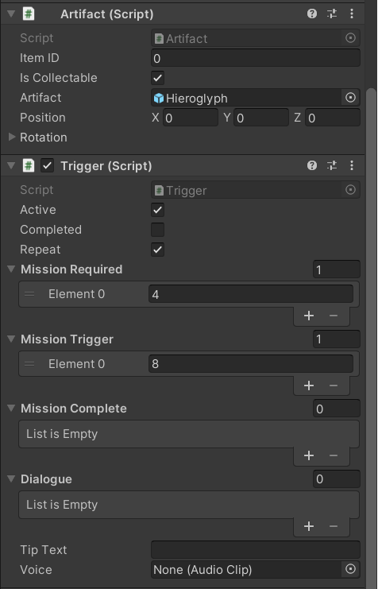
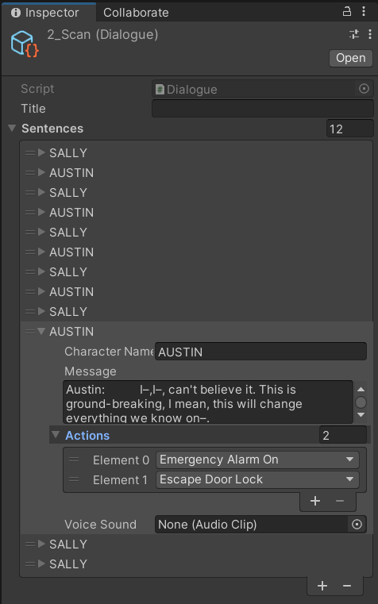
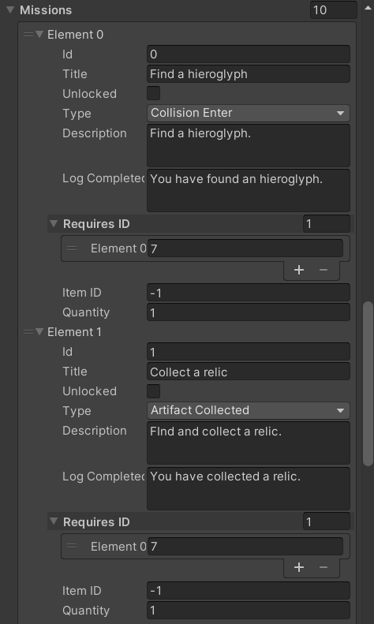

# 3D Game System - Unity3d (C#)

Rescued from an old project hosted at Unity3d Cloud.

**Mostly legacy code**, for slowly converting to an updated and more generic game system.

3D assets and game graphics were created by other team members, so not included in here.

## Features included (*legacy*):

- Game Manager Singleton
- Preload multiple scenes
- Game Database
- Saving game progress to file
- Player Inventory
- Dialogues system
- Missions system
- Events triggers
- Very basic farming

Dialogues, missions, game artifacts, game events, all manageable from Unity Editor.

## Future Plans:

- Update compatibility to latest Unity version
- Turn code into more a generic, more independent modular system
- Make more use of Unity Editor features

## Sample Editor Screens:

### Game Manager

### Interactable item

### Dialogue

Dialogues as scriptable objects.

 (Select "Dialogue" > "New" from Editor menu.)

### Database

Database sample showing game missions.

